How to create an account and configure TOTP
========================================

Create an encryption key
---------------------

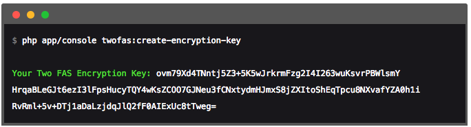

Copy the encryption key and paste to ``config.yml``:

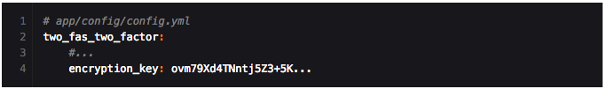

But we recommend that you keep this value in `parameters.yml` and `parameters.yml.dist` and add reference to variable in `config.yml`.

Create an account
--------------

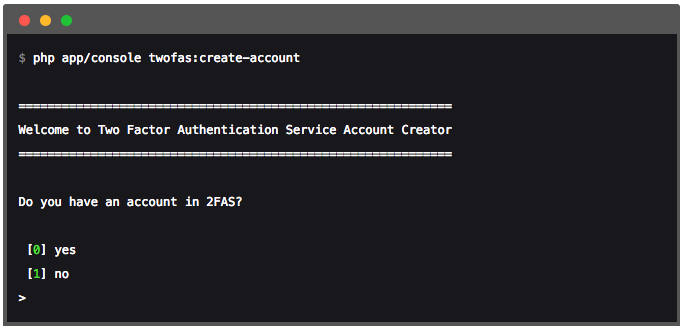

Choose one of the above options and provide your data:

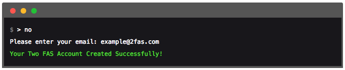

Add account in your mobile app
------------------------------

1. Log in to your website and go to **"/2fas/index"**.

This is a simple dashboard to show and manage your settings:

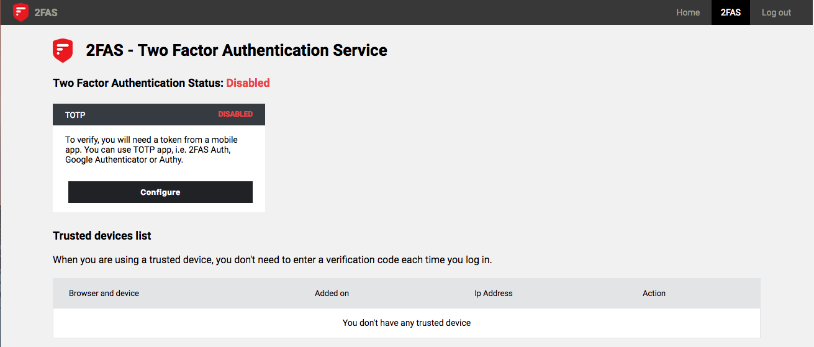

> **Note**
>
>This dashboard comes from our demo application and has included our css styles.
>After installing this bundle by default you haven't any styles so you get a white, plain html page.
>But if you want, you can include it.

2. Click on the *"Configure"* under the TOTP channel.

3. You will see the configuration page:

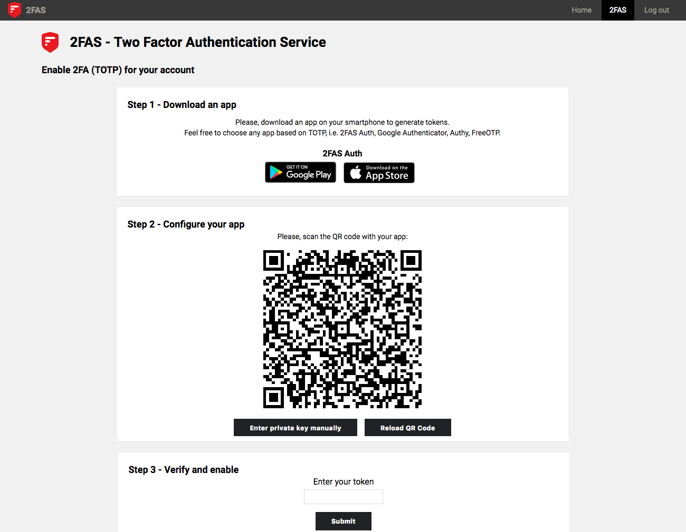

4. Open your mobile app:

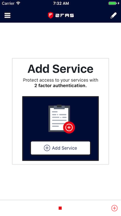

5. Scan QR code:

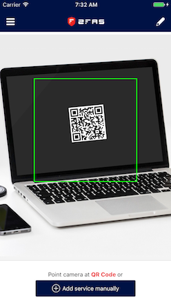

6. Your mobile app will generate a code:

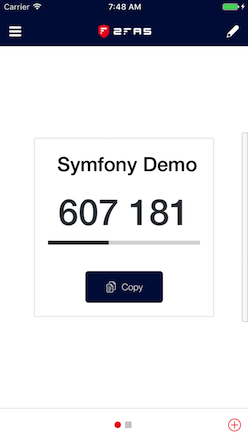

7. Type this code in form and click **Submit**

8. Configuration is complete but the second factor is still disabled:

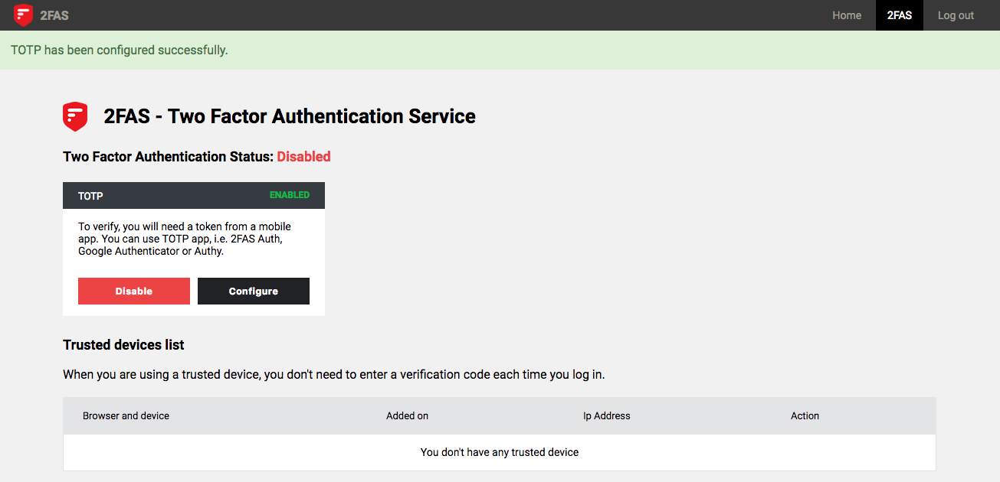

9. Go to console and enable the second factor:

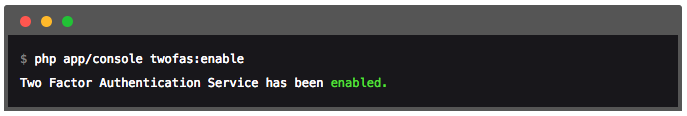

10. Now you will be protected by 2FAS, next time you login, after your login form you will see the second factor form:

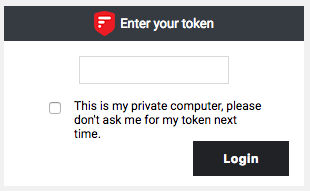